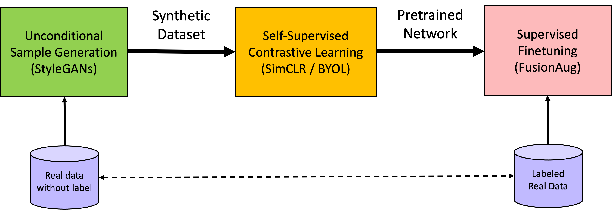

# GSCL-PyTorch

> PyTorch implementation of [GSCL: Generative Self-supervised Contrastive Learning for Vein-based Biometric Verification](https://ieeexplore.ieee.org/abstract/document/10428026).

## Abstract

Vein-based biometric technology offers secure
identity authentication due to the concealed nature of blood
vessels. Despite the promising performance of deep learning-
based biometric vein recognition, the scarcity of vein data hinders
the discriminative power of deep features, thus affecting overall
performance. To tackle this problem, this paper presents a
generative self-supervised contrastive learning (GSCL) scheme,
designed from a data-centric viewpoint to fully mine the potential
prior knowledge from limited vein data for improving feature
representations. GSCL first utilizes a style-based generator to
model vein image distribution and then generate numerous vein
image samples. These generated vein images are then leveraged
to pretrain the feature extraction network via self-supervised
contrastive learning. Subsequently, the network undergoes fur-
ther fine-tuning using the original training data in a supervised
manner. This systematic combination of generative and discrimi-
native modeling allows the network to comprehensively excavate
the semantic prior knowledge inherent in vein data, ultimately
improving the quality of feature representations. In addition, we
investigate a multi-template enrollment method for improving
practical verification accuracy. Extensive experiments conducted
on public finger vein and palm vein databases, as well as a newly
collected finger vein video database, demonstrate the effectiveness
of GSCL in improving representation quality.

<div align=center>

</div>

## Installation
```bash
$ conda env create --file env.yml
$ conda activate gscl
$ pip install -e vein_image_generation
```

## Usage & results of vein image generation
Plese refer to [README](./vein_image_generation/README.md)

## Usage & results of vein feature learning for biometric verification
Plese refer to [README](./vein_feature_learning/README.md)

## Citation
```bibtex
@article{ou2024gscl,
  title={GSCL: Generative Self-Supervised Contrastive Learning for Vein-Based Biometric Verification},
  author={Ou, Wei-Feng and Po, Lai-Man and Huang, Xiu-Feng and Yu, Wing-Yin and Zhao, Yu-Zhi},
  journal={IEEE Transactions on Biometrics, Behavior, and Identity Science},
  year={2024},
  publisher={IEEE}
}
```
